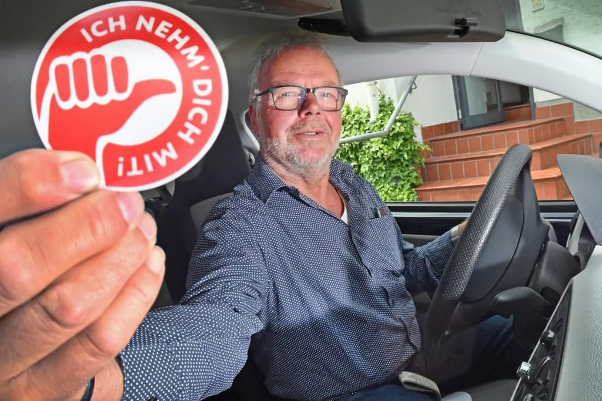
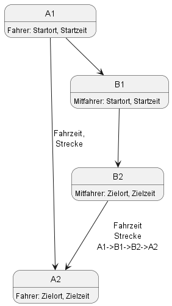
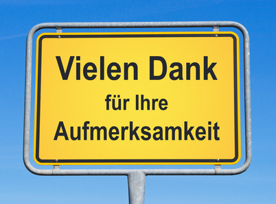

= FlotteLotte Ridesharing
// = image:img/activebackup_icon.png[]  Vorstellung: FlotteLotte Ridesharing
//= Title Slide
:revealjsdir: reveal.js
:revealjs_slideNumber: c/t
:revealjs_showSlideNumber: all
:revealjs_width: 960
:revealjs_height: 600
:revealjs_theme: white
:revealjs_pdfmaxpagesperslide: 3
:customcss: flottelotte.css

[.columns]
==  TEAM: Flotte Lotte

[.column]
* Marc (Programmierung),
* Roland (Programmierung)
* Markus (Konzept, Präsentation)

[.column]

== Idee

neue Mobilitätsmöglichkeiten für die ländlichen Regionen schaffen

[.columns]
== Beobachtung

[.column]
* viele Menschen sind allein auf der Straße unterwegs
* viele Fahrten können mit mehreren Personen durchgeführt werden, da sie ähnliche Startpunkte und Ziele haben, oder diese auf der Strecke liegen
* bisherige Mitfahrgelegenheiten, haben noch nicht gezündet. Woran liegt das?

[.column]

== Unsere Lösung

* eine App, die es Fahrern ermöglicht, ihre Fahrt spontan anzubieten
* mögliche Mitfahrer werden bei Fahrtantritt vorgeschlagen
* Fahrer und Mitfahrer können sich über die App finden, um die Fahrt gemeinsam durchzuführen. Der Aufwand für den Fahrer ist minimal.

== Zielgruppe

* Menschen, die auf dem Land wohnen und in die Stadt pendeln
* Fahrer, die eine Fahrt spontan ode regelmäßig anbieten möchten, ohne sich vorher festlegen zu müssen
* Menschen, die auf das Auto verzichten möchten, aber es nicht können da der ÖPNV nicht ausreichend ist
* Altersgruppen (6 - 86 Jahre)

== Vorteile der Lösung

* zusätzliche Mobilitätsmöglichkeiten für die ländlich Region
* reduzierung des CO2 Ausstoß, Lärmbelastung, ..
* entspannung der Parkplatzsituation in der Stadt
* versärkte Nutzung des ÖPNV, da eine Rückfahrtmöglichkeit über eine alternative Mitfahrgelegenheit besteht
* zusätzliche Daten um den ÖPNV besser zu planen

== Funktionsweise

* Mitfahrer meldet eine Fahrt an
* Fahrer steigt ins Auto, gibt sein Ziel an. Er bekommt mögliche Mitfahrer angezeigt, die auf der Strecke liegen. Die Mitfahrt können direkt bestätigt werden
* Der Mitfahrer bekommt die Info das er zur Zeit X an dem Punkt Y mitgenommen wird
* Der Fahrer, steuert den Mitfahrer an, nimmt ihn bis zum dessen Zielpunkt mit und fährt weiter zu seinem Ziel
* reduziert die Anzahl der Fahrzeuge auf der Straße
* Der Mitfahrer kann sich beim Fahrer bedanken. Beide können sich anonym bewerten.

== Abgrenzung zu anderen Systemen

* es müssen keine Fahrten eingestellt werden. Der Fahre bleibt zeitlich flexibel
* Fokus auf Kurzstrecken und Teilabschnitte
* die Bezahlung des Fahrers ist optional
* Community Gedanke auf den Landkreis projiziert

== Ziel unserer Arbeit

* Entwicklung einer handfesten Idee mit allen notwendigen Informationen, um die Idee in der Basis vorzustellen und weitere Mitstreiter zu gewinnen
* Bereitstellung einer Präsentation
* Erstellung eines Prototyps, der die Idee veranschaulicht und die Machbarkeit demonstriert

== Ausblick

* Konzept weiter ausarbeiten
* Präsentation "more fancy" machen
* Kontakte knüpfen, Mitstreiter finden
* Idee den Entscheidern vorstellen, die den Strukturwandel vorantreiben wollen, die Mobilität verbessern wollen und den ländlichen Raum attratkiver machen wollen. (Landkreis, ÖPNV, ..).

== Prototyp

* https://github.com/supermarche/flotteLotte

== Quellen

=== Quellen - Informationen

* https://github.com/features/copilot
* https://www.openstreetmap.de/
* https://www.geofabrik.de/
* https://www.jetbrains.com/help/idea/ai-assistant.html
* https://katja-diehl.de/wende-rueckwaerts-beliebter-on-demand-verkehr-omobi-droht-das-politische-aus-ein-gespraech-mit-gruender-clemens-deyerling-und-prof-andreas-knie/
* https://www.abendblatt.de/nachrichten/article208389513/Mitfahrportale-Auto-teilen-Kosten-sparen.html

== Quellen - Bilder

* https://www.westfalen-blatt.de/owl/bielefeld/die-mitfahrgelegenheit-1139614?&npg
* https://www.andreajoost.de/2015/02/vielen-dank-fuer-ihre-aufmerksamkeit/

[%notitle]
== Danke

